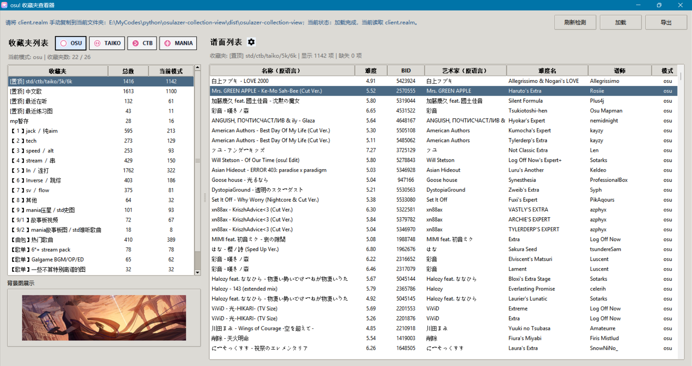
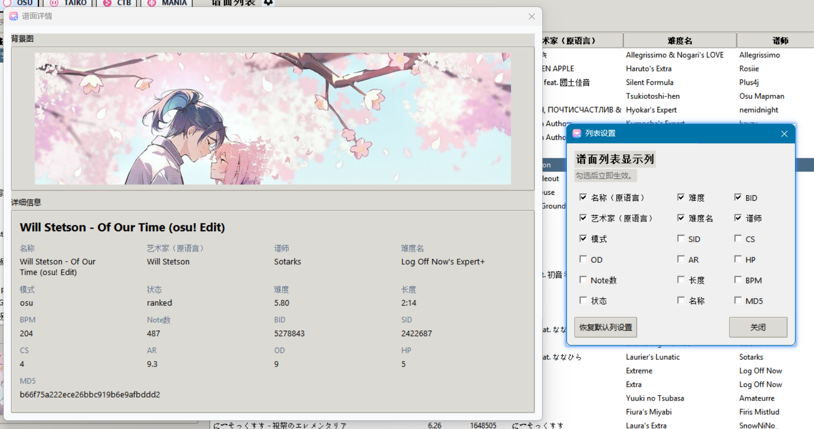

# osulazer-collection-view

一个用于查看 `osu!lazer` 收藏夹的桌面工具（vibe coding）。

它会直接读取项目根目录下的 `client.realm`，调用仓库内的 C# 提取器把收藏夹数据导出成 JSON，再由 Python 图形界面展示收藏夹、谱面列表、背景图预览和详情弹窗。

下载地址：[百度网盘](https://pan.baidu.com/s/1vOLGLnqPElFBv41toFBQ_w?pwd=mkmu)




## 功能

- 检测项目目录下的 `client.realm`
- 按模式筛选：`osu`、`taiko`、`ctb`、`mania`
- 展示收藏夹列表，默认按修改时间倒序排列（由近及远）
- 展示当前收藏夹下的谱面列表
- 左侧预览当前选中谱面的背景图
- 双击谱面弹出详细信息
- 导出当前展示列表到 Excel
- 可自定义谱面列表显示列

## 使用说明

### 发布版使用

发布目录：

```text
dist/osulazer-collection-view/
```

使用步骤：

1. 把 `client.realm` 复制到 `osulazer-collection-view.exe` 同目录
2. 双击 `osulazer-collection-view.exe`
3. 点击“刷新检测”
4. 确认检测到 `client.realm`
5. 点击“加载”

说明：

- 发布版已经包含 Python 运行时
- 发布版已经包含自包含的 C# / .NET 提取器
- 目标机器不需要额外安装 Python 或 .NET

### 收藏夹与模式筛选

- 左侧收藏夹列表默认按时间倒序展示，越新的收藏夹越靠前
- 左侧选择收藏夹
- 左上角切换模式
- 右侧查看当前模式下的谱面列表

### 背景图预览

- 单击谱面列表项
- 左下角会显示该谱面的背景图

### 详细信息

- 双击谱面列表项
- 会弹出谱面详情窗口

### 导出 Excel

- 右上角点击“导出”
- 选择保存路径
- 导出内容为“当前展示的谱面列表”
- 导出列会跟随当前表格的显示列

### 列设置

- 点击“谱面列表”右侧的设置图标
- 勾选或取消列
- 如果新增了显示列，可能需要手动拖动表头分隔线调整列宽，才能完整显示内容
- 更改会立即生效并保存在：

```text
runtime/ui_settings.json
```

## 运行时文件

程序运行后会生成这些内容：

- `runtime/covers/`：缓存的背景图
- `runtime/extracted.json`：当前最新的提取结果
- `runtime/ui_settings.json`：界面列设置

## 常见问题

### 1. 点击“加载”后失败

先检查：

- `osulazer-collection-view.exe` 同目录是否真的存在 `client.realm`
- 是否点击了“刷新检测”

### 2. 背景图不显示

可能原因：

- 谱面条目缺少本地信息
- 对应 `sid` 不存在
- 网络暂时无法访问 `assets.ppy.sh`
- 图片尚未下载完成

### 3. 为什么需要 C# 提取器

因为 `client.realm` 是 `osu!lazer` 使用的 Realm 数据库，直接在 Python 里读取这套结构并不方便。当前项目通过 Realm 的 .NET 生态做只读提取，再把结果交给 Python 界面使用。

## 打包发布

如果你想重新打包成"多文件、双击 exe 即可运行"的版本，可以直接执行：

```powershell
.\build.ps1
```

打包脚本会自动完成这些事：

- 用 `dotnet publish` 生成自包含的 C# 提取器
- 安装 / 更新 Python 打包依赖
- 用 `PyInstaller --onedir` 打包 Python 图形界面
- 使用 `assets/logo.ico` 作为应用图标

注意：打包前必须先构建 C# 提取器，构建脚本会自动完成。

## 开发与构建

### 目录结构

```text
osulazer-collection-view/
|-- app.py
|-- requirements.txt
|-- client.realm                # 需要手动放到这里
|-- collection_view/            # Python 代码
|-- extractor/                  # C# / .NET 提取器
|-- assets/                     # 模式图标、设置图标
`-- runtime/                    # 运行时生成内容
```

### 开发版启动

开发前需要先构建 C# 提取器：

```powershell
.\build_extractor.ps1
```

然后安装 Python 依赖并启动：

```powershell
pip install -r requirements.txt
python app.py
```

开发版启动后：

1. 点击"刷新检测"
2. 确认检测到 `client.realm`
3. 点击"加载"

### Python 环境

- Python `3.11` 或更高版本
- 建议使用虚拟环境

当前 Python 依赖：

- `Pillow`
- `openpyxl`
- `requests`

### C# / .NET 环境

本项目虽然主界面是 Python，但数据提取依赖一个 C# 控制台程序，位于 [`extractor/`](./extractor)。

提取器当前配置：

- SDK 风格项目
- 目标框架：`net9.0`
- NuGet 包：`Realm 20.1.0`
- 使用 `FodyWeavers.xml` 启用 Realm 的编织步骤

你需要准备：

1. 安装 `.NET SDK 9.0` 或更高版本
2. 保证 `dotnet` 已加入系统 `PATH`
3. 能正常访问 NuGet 包源

建议检查命令：

```powershell
dotnet --info
dotnet --list-sdks
```

### C# 提取器说明

提取器项目文件：

- [`extractor/CollectionRealmExtractor.csproj`](./extractor/CollectionRealmExtractor.csproj)
- [`extractor/Program.cs`](./extractor/Program.cs)
- [`extractor/FodyWeavers.xml`](./extractor/FodyWeavers.xml)

项目使用方式：

- 开发时需要先运行 `build_extractor.ps1` 构建提取器
- 打包时 `build.ps1` 会自动构建提取器

如果你想手动构建提取器，可以运行：

```powershell
.\build_extractor.ps1
```

如果你想单独测试提取器，可运行：

```powershell
.\build\extractor_runtime\CollectionRealmExtractor.exe .\client.realm .\runtime\extracted.json
```

### 版本发布

项目使用 GitHub Actions 自动构建和发布。发布新版本的步骤：

1. 更新代码并提交
2. 创建版本标签：
   ```powershell
   git tag v1.0.0
   git push origin v1.0.0
   ```
3. GitHub Actions 会自动构建并创建 Release
4. 构建产物会自动上传到 Release 页面

标签格式：`v` + 版本号（如 `v1.0.0`、`v1.2.3`）

## 依赖版本

### Python

- Python `3.11+`
- Pillow `>=10.4.0`
- openpyxl `>=3.1.5`
- requests `>=2.32.3`

### .NET / C#

- .NET SDK `9.0+`
- Target Framework: `net9.0`
- Realm `20.1.0`

## 备注

- 背景图使用公开资源地址：
  `https://assets.ppy.sh/beatmaps/{sid}/covers/cover.jpg`
- 对于收藏夹中存在但当前本地数据库无法解析的条目，会显示为缺失项
- 提取器以只读方式打开 `client.realm`
